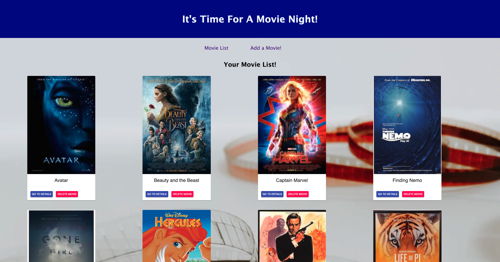
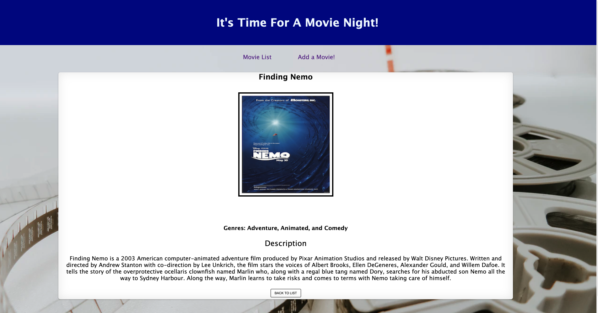
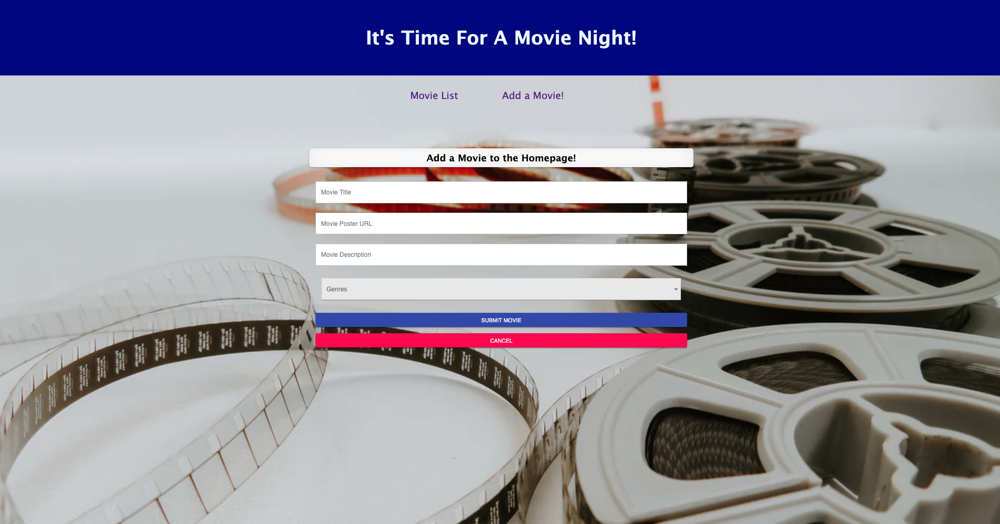

# The Movie Saga Web App!

## Description

Duration: 15hrs

This web application is a full-stack movie list that the user can populate themselves! The home page displays the user's favorite movies in grid format. The movie's poster is displayed along with a 'Go to Details' button that navigates the user to a details page for that specific movie. The details page displays movie title, poster, description, and genres. This is the perfect web application for someone to reference back to when it is time for movie night! The user can delete movies from the list if there was an error to the input information, or they just no longer like the movie!  

## Screen Shot

## Prerequisites

- Node.js
- Postico

## Installation 

1. Open Postico
2. Copy code from database.sql into your db
3. run `npm install`
4. In two different terminals run `npm run server` and `npm run client`
5. Web app is viewable on localhost:3000

## Usage

- On load you should see a list of all the movies  
- On the homepage users can click to go to a specific movie's detail page or delete the movie from the list
- If users click the 'Add a Movie!' link on the nav bar - they can use the form on the page to add a new movie to the list!
- Once the user clicks the 'submit' button they will be taken back to the home page to see the new movie they have added 

## Built With 

- React
- Redux
- Redux-Saga
- SQL
- Axios
- Material-UI core/icons
- CSS 

## Acknowledgment 

Thanks to Prime Digital Academy who equipped and helped me to make this application a reality. Also, thanks to my cohort, Vatti, for assisting me with any problems that arose while I was working on my project (WAKA WAKA). 

## Support

Please reach out to me through email at bradybaker82@gmail.com with any questions or concerns about this project!
